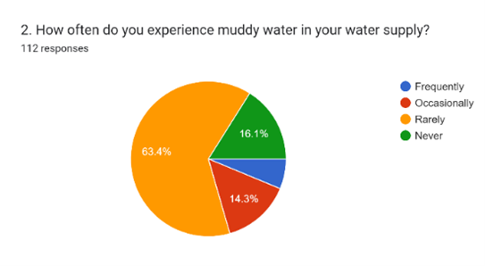
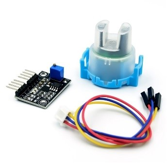
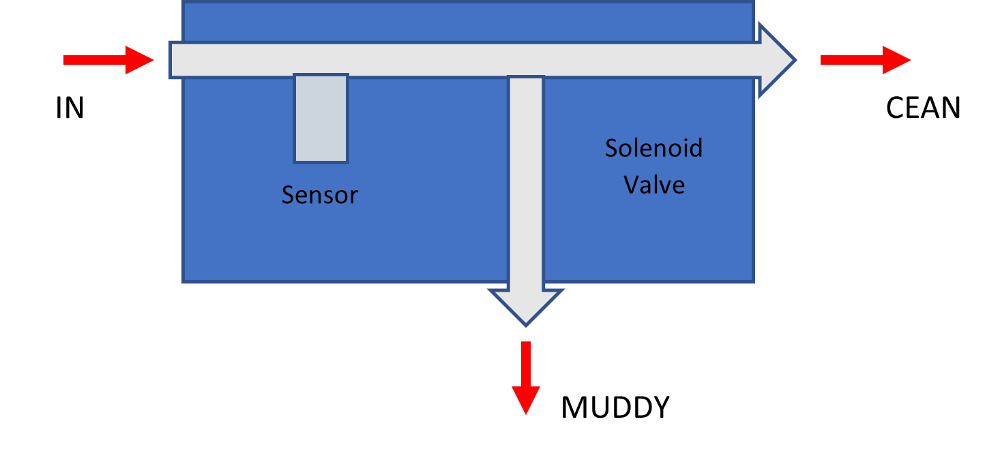
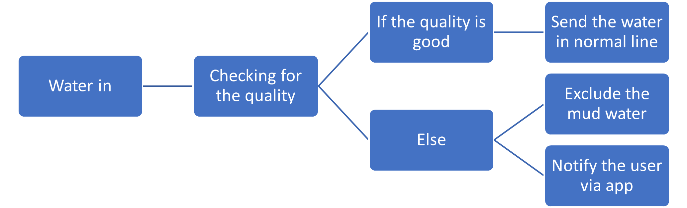
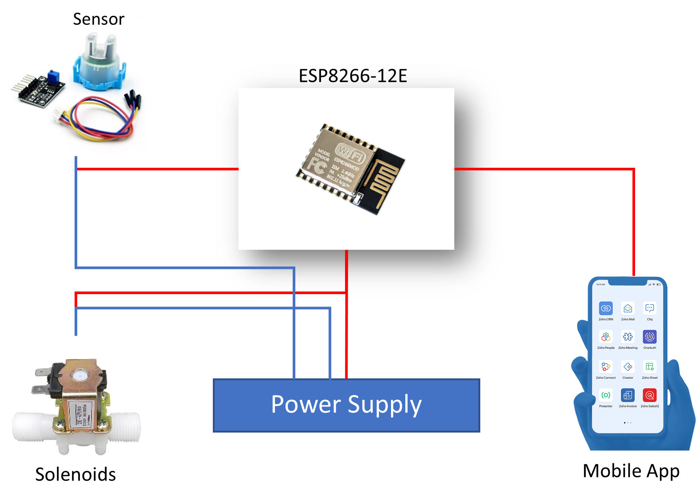
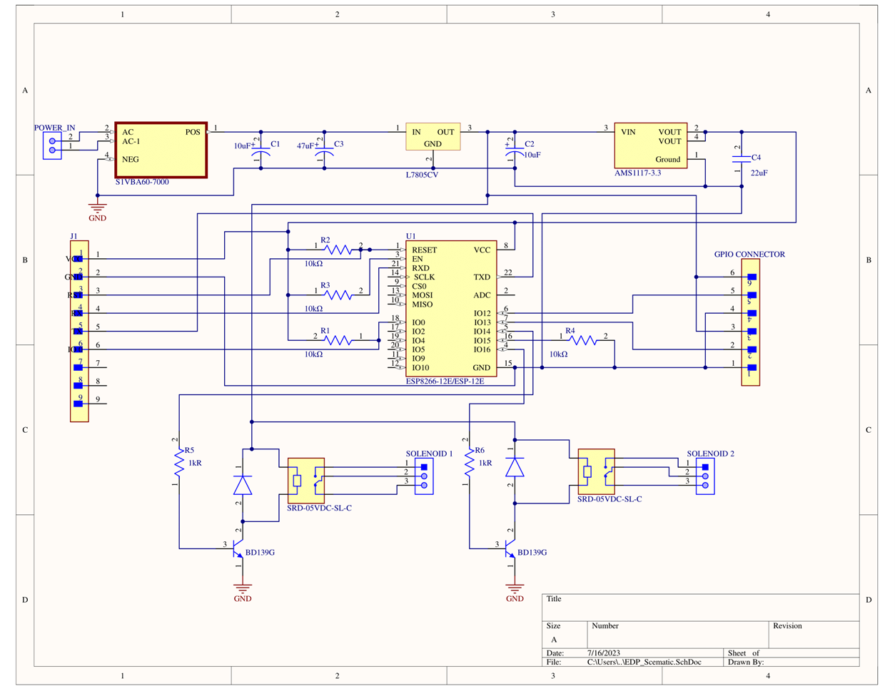
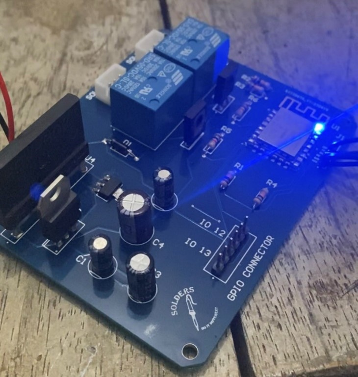
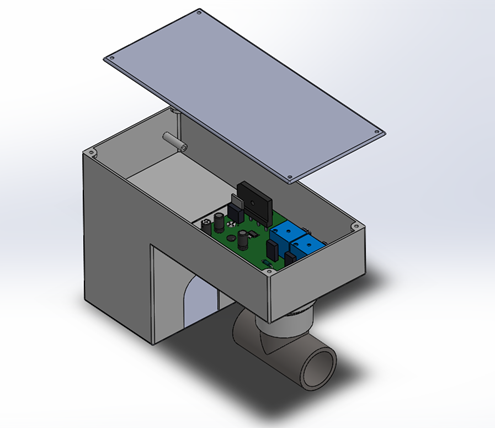
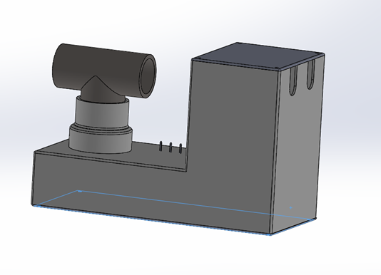
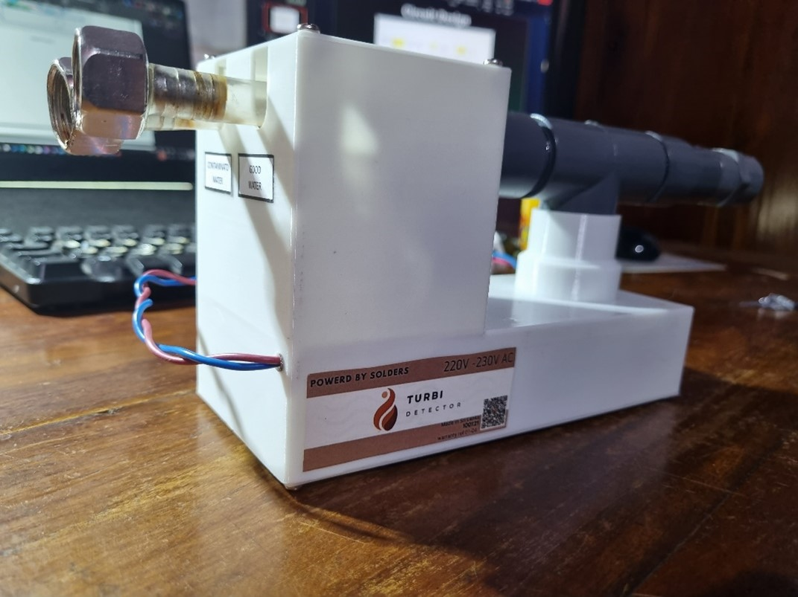

# Turbi Detector

**Group Solders - ENGINEERING DESIGN PROJECT**

---

## Table of Contents
- [Turbi Detector](#turbi-detector)
  - [Table of Contents](#table-of-contents)
  - [Problem Description and Motivation](#problem-description-and-motivation)
    - [Problem Description](#problem-description)
    - [Motivation](#motivation)
  - 
  - [Technical Feasibility](#technical-feasibility)
    - [Key Components](#key-components)
  - [Product Architecture](#product-architecture)
  - [Initial Sketches of the Product Enclosures](#initial-sketches-of-the-product-enclosures)
  - [Marketing, Sales, and After-Sale Service Considerations](#marketing-sales-and-after-sale-service-considerations)
    - [Marketing Strategies](#marketing-strategies)
    - [Target Markets](#target-markets)
    - [Product Packaging](#product-packaging)
    - [Warranty Terms](#warranty-terms)
    - [After Sales Service](#after-sales-service)
    - [Reuse/Recycle and Disposal](#reuserecycle-and-disposal)
    - [Sales Channels](#sales-channels)
  - [Project Budget with Bill of Quantities (BOQ)](#project-budget-with-bill-of-quantities-boq)
    - [Total Production Cost](#total-production-cost)
  - [Conclusion](#conclusion)
  - [References](#references)

---

## Problem Description and Motivation

### Problem Description
Mud in water pipelines poses significant problems for households, businesses, and industries by causing clogged pipes, decreased water pressure, and contamination. This project aims to develop a tool that detects mud in water pipelines, diverts contaminated water, and ensures a safe water supply. The tool is also intended to assist industries in harsh environments such as mining and quarrying.

### Motivation
The motivation for the Turbi Detector project stems from the widespread issue of water contamination due to mud, which impacts various sectors and everyday life. By creating a reliable and efficient detection system, we aim to improve water quality and pipeline maintenance, ultimately contributing to better public health and industrial operations.

---

## Technical Feasibility
The Turbi Detector uses an infrared sensor to detect mud in water. The sensor emits a beam of light through the water, and changes in light intensity caused by mud particles trigger an alert to the control system. The system includes continuous water quality monitoring capabilities using an ESP 8266 12e and a notification system to inform users of persistent issues via a mobile app.

### Key Components
- **Infrared Sensor**: Detects mud particles by measuring changes in light intensity.
  

  

  

- **Control System**: Processes sensor data and triggers alerts.
- **ESP 8266 12e**: Facilitates continuous monitoring and data transmission.
- **Mobile App**: Notifies users of water quality issues and system status.

 

 

---

## Product Architecture
The product architecture includes a detailed design and assembly of the Turbi Detector system. The architecture ensures reliable detection and management of mud in water supplies through a well-integrated system of sensors, control units, and communication modules.

PCB Dsign

 Top view

 #D view

 Completed PCB

---

## Initial Sketches of the Product Enclosures
Initial design sketches provide a visual representation of the product, demonstrating how it fits into existing water pipeline systems and its physical appearance.

---

## Marketing, Sales, and After-Sale Service Considerations

### Marketing Strategies
- **Social Media Marketing**
- **Influencer Marketing**
- **Email Marketing**
- **Content Marketing**

### Target Markets
The Turbi Detector targets both households and industries that require clean water and efficient pipeline maintenance. Emphasis will be placed on the product's reliability and benefits.

### Product Packaging
Eco-friendly and sturdy packaging will protect the product during transport and emphasize the product's environmental benefits.

### Warranty Terms
A 6-month warranty period and a 10-month service period cover any defects in materials or workmanship. Clear communication and easy access to warranty claims are ensured.

### After Sales Service
Clear instructions for cleaning and upkeep are provided to ensure product longevity. Repair services are available for any damages or malfunctions during the warranty and service period.

### Reuse/Recycle and Disposal
Customers are encouraged to reuse and recycle the product. The design facilitates easy disassembly and recycling at the end of its life cycle. Recycling programs or incentives may be offered.

### Sales Channels
- **Online Marketplaces**
- **E-Commerce Website**
- **Retail Stores**

---

## Project Budget with Bill of Quantities (BOQ)

| Component                          | Qty | Unit Price (LKR) | Total Price (LKR) |
| ---------------------------------- | --- | ---------------- | ----------------- |
| Infrared Sensor                    | 1   | 1500.00          | 1500.00           |
| ESP 8266 12e                       | 1   | 1200.00          | 1200.00           |
| Control System Components          | 1   | 1000.00          | 1000.00           |
| Mobile App Development             | 1   | 5000.00          | 5000.00           |
| Packaging Materials                | 1   | 500.00           | 500.00            |
| **Total**                          |     |                  | **10200.00**      |

### Total Production Cost
- Rs 5000 (For multiple product manufacturing)
- PCB Printing and Enclosure Manufacturing - Rs 300 (per unit)
- Market Price - Rs 6000
- Manufacturing Quantities - 100 units

---

## Conclusion
The Turbi Detector project addresses a critical issue of mud contamination in water pipelines, offering a reliable detection and management solution. With a clear product architecture, effective marketing strategies, and a detailed project budget, the Turbi Detector is poised to make a significant impact on water quality and pipeline maintenance.

---

## References
- [Infrared Sensor Technology](#)
- [ESP 8266 12e Documentation](#)
- [Mobile App Development Resources](#)
- [Marketing Strategies for Tech Products](#)

For more information about the Turbi Detector, contact us:

- Email: [nidulam2001@gmail.com ](nidulam2001@gmail.com)
